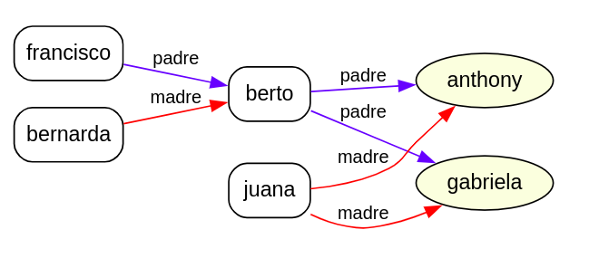
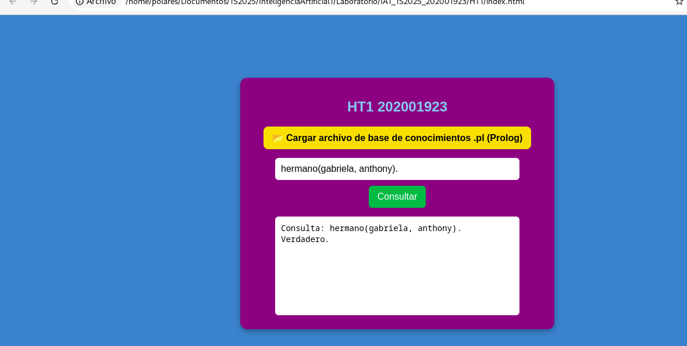
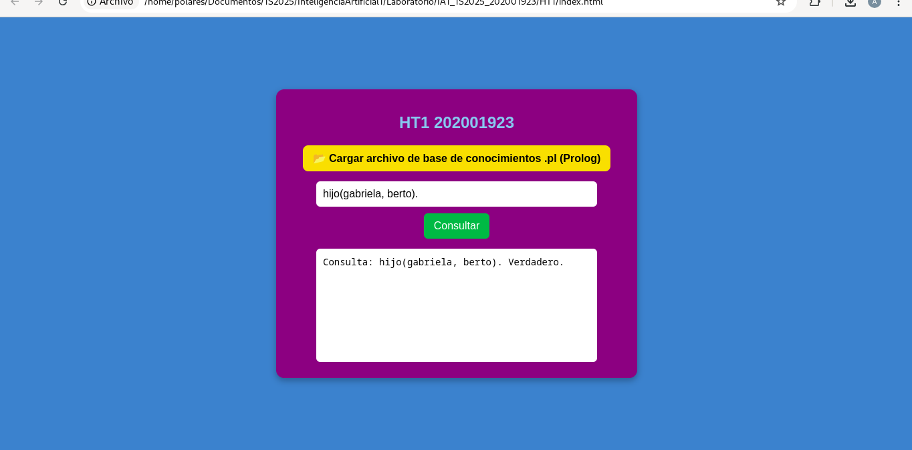
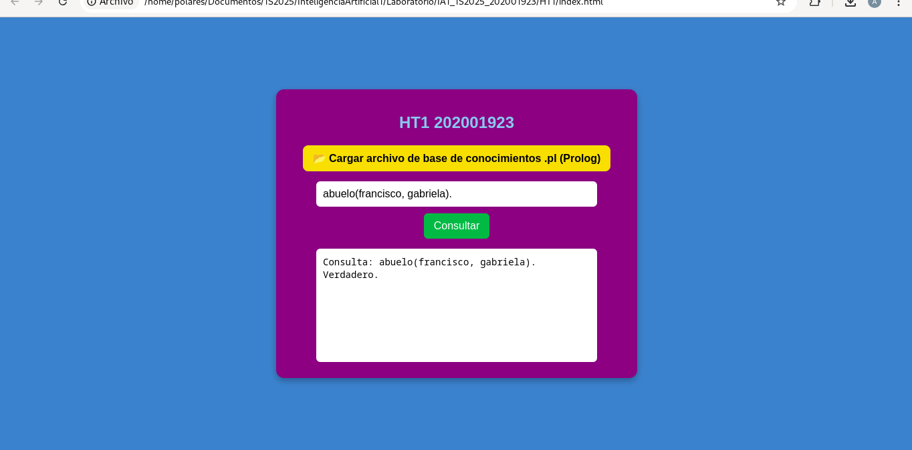
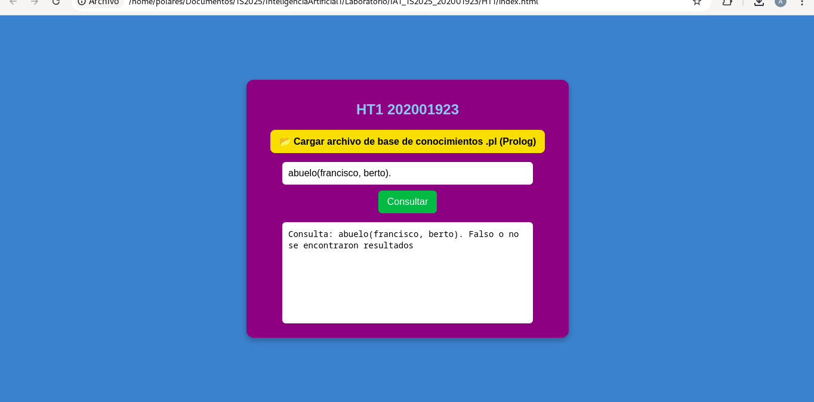

# Hoja de trabajo 1

**Laboratorio Inteligencia Artificial 1**:

**Anthony Alexander Aquino Santiago**

**202001923**

## Gráfico del árbol genealógico
Se modelaron solo algunas relaciones, por ejemplo, los padres de mi papá, mi mamá y sólo una de mis hermanas.

## Consulta 1 - Hermandad
Yo y mi hermana, resultado, true.

## Consulta 2 - Hijos
Se verifica si mi hermana es hija de Berto, mi papá.

## Consulta 3 - Abuelo
Se verifica si Francisco, mi abuelo, es abuelo de mi hermana.

## Consulta errónea - Abuelo
Se verifica si Francisco, mi abuelo, es abuelo de mi papá, lo cual es falso.
